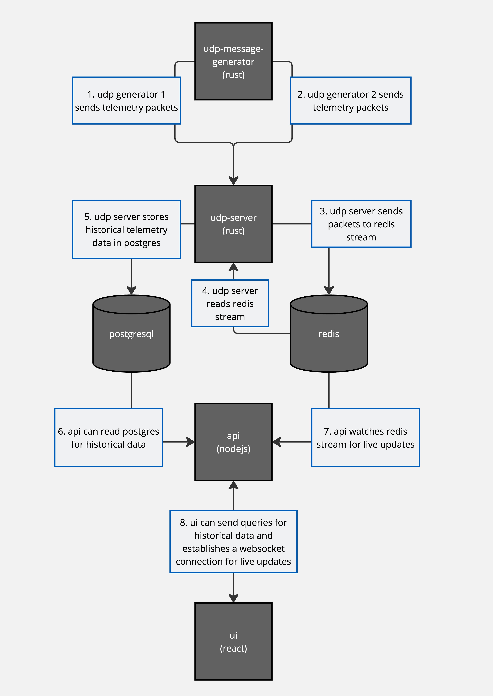

# turion-take-home

## Features

1. **Telemetry Packet Generation**: Generates random telemetry data and sends it
   as raw byte packets over UDP.
2. **Data Ingestion**: Ingests telemetry packets into a database for storage and
   analysis.
3. **Historical Data API**: Provides endpoints to query historical telemetry
   data by satellite ID and time range.
4. **Real-Time Data Streaming**: Streams real-time telemetry data to the
   frontend.
5. **Alerts**: Detects and alerts operators of dangerous telemetry levels.

## Components

### API

- **Framework**: NestJS
- **Location**: [api/](api/)

### UDP Server

- **Language**: Rust
- **Location**: [udp-server/](udp-server/)

### UDP Message Generator

- **Language**: Rust
- **Location**: [udp-message-generator/](udp-message-generator/)

### Frontend

- **Framework**: React with Vite
- **Location**: [ui/](ui/)

## Setup and Running

### Prerequisites

- Docker

### Steps

1. **Start the application**:
   ```sh
   docker compose up
   ```
2. **View the UI** To view the user interface, open your web browser and go to:
   [http://localhost:4173/](http://localhost:4173/)

## Databases

### PostgreSQL

- Used for storing historical telemetry data.

### Redis

- Used for buffering the incoming telemetry packets.

## Future Scalability and Optimization

- Split the udp-server into 2 parts, one for ingesting the telemetry packets,
  and another for writing to the postgres database.
- Batch the packets before storing them in redis.
- Use pipelining and binary protocols for redis.
- Send binary data using the COPY command for storing large amounts of data in
  postgres efficiently.
- Control the rate of data consumption from redis to the api by using count and
  sleep.

## System Design


